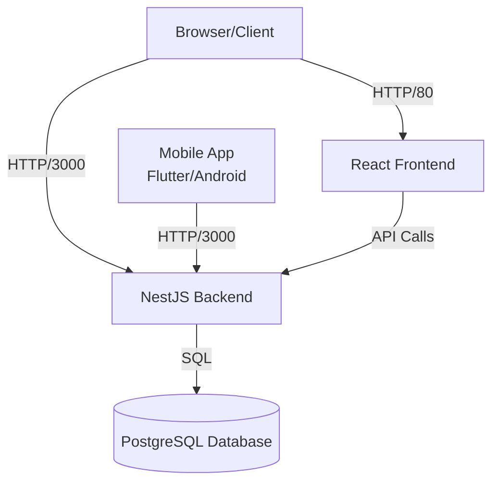

# Real Estate Marketplace - Security Assessment

Welcome to the security assessment for the Real Estate Marketplace application.

## Objective
Your mission is to perform a comprehensive security audit of this application. The application contains numerous intentional security vulnerabilities ranging from common OWASP Top 10 issues to more complex logic flaws.

## Architecture
The application is a containerized full-stack system with web and mobile components:



### Components:
- **Frontend**: React (Vite) running on port 5173 (mapped to 80 in prod/docker)
- **Backend**: NestJS API running on port 3000
- **Database**: PostgreSQL running on port 5432
- **Mobile App**: Flutter application (Android) located in `mobile_app/` directory

## Getting Started

The application is designed to be run using Docker Compose. You are expected to figure out how to build and start the services using the provided `docker-compose.yml` file.

1.  **Analyze the Infrastructure**: Review the `docker-compose.yml` to understand the services and their configurations.
2.  **Start the Application**: Get the stack running locally.
3.  **Hunt for Vulnerabilities**:
    - Perform a comprehensive security assessment of all application components
    - Test authentication and authorization mechanisms
    - Analyze all API endpoints and data flows
    - Review source code for security weaknesses
    - Test the mobile application (requires Flutter SDK and Android environment)
    - Examine infrastructure configurations

### Testing the Mobile App
A Flutter mobile application is included in the `mobile_app/` directory. To run it:

**Prerequisites:**
- The backend must be running (start with Docker Compose first)
- Flutter SDK installed
- Android emulator or physical device connected

```bash
cd mobile_app
flutter pub get
flutter run
```

The mobile app connects to the backend API at `http://localhost:3000` (or `http://10.0.2.2:3000` for Android emulator).

### Task 2: Secure CI/CD Pipeline
Implement a GitLab CI/CD pipeline (`.gitlab-ci.yml`) to automate security scanning. Your pipeline should include:
- Static Application Security Testing (SAST)
- Dependency Scanning
- Container Scanning
- Secret Detection
- **Infrastructure as Code (IaC) Scanning** (Terraform)

### Task 3: Infrastructure Security Audit
Review the Terraform configuration in the `terraform/` directory:
- Identify security misconfigurations and vulnerabilities
- Analyze network security (security lists, ingress/egress rules)
- Check for hardcoded secrets and credentials
- Evaluate encryption, backup, and access control settings
- Include IaC findings in your security report

## Deliverables
At the end of your assessment, please submit:

1.  **Security Report**: A comprehensive PDF or Markdown report containing:
    -   **Executive Summary**: High-level overview of the security posture.
    -   **Findings**: Detailed list of all discovered vulnerabilities, prioritized by severity (Critical, High, Medium, Low).
    -   **Evidence**: Screenshots, code snippets, proof-of-concept exploits, or reproduction steps for each finding.
    -   **Recommendations**: Specific technical guidance on how to fix each issue.

2.  **CI/CD Configuration**: Your `.gitlab-ci.yml` file demonstrating the automated security checks.

## Notes
- The database is pre-populated with sample data.
- You have full access to the source code provided in this repository. White-box testing is encouraged.
- A mobile application is included - you will need Flutter SDK to build and test it.
- **Important**: The mobile app requires the backend to be running. Start the Docker services before testing the mobile application.

> **Note**: This repository does not include examiner materials or answer keys. You are expected to discover all vulnerabilities through your own analysis and testing.

Good luck!
